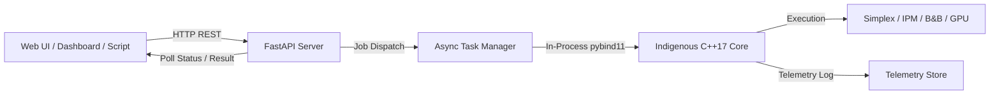

# Backend API Specification: Indigenous Optimization Engine

## 1. Architectural Overview

The solver backend provides a high-performance, asynchronous REST API built with **FastAPI** (`py/api/`). It connects web frontends, industrial plant DCS systems, and external schedulers directly to the C++ core via `pybind11` bindings.



---

## 2. API Endpoints

### 2.1 General Problem Submission & Polling

#### `POST /api/v1/solve`
Submits an optimization job (LP, MILP, or QP).
- **Request Body**:
  - `format`: `"mps"` or `"json"`
  - `problem_data`: raw MPS string content or serialized problem specification
  - `options`: Optional strategy configuration (algorithm, presolve, pricing, etc.)
- **Response** (`202 Accepted`):
  ```json
  {
    "job_id": "job_e9b2f4c1",
    "status": "QUEUED",
    "submitted_at": "2026-09-24T11:00:00Z"
  }
  ```

#### `GET /api/v1/jobs/{job_id}`
Polls the execution state of a submitted job.
- **Response** (`200 OK`):
  ```json
  {
    "job_id": "job_e9b2f4c1",
    "status": "OPTIMAL",
    "elapsed_ms": 1.25,
    "completed": true,
    "error_message": null
  }
  ```

#### `GET /api/v1/jobs/{job_id}/solution`
Retrieves the comprehensive numerical solution, basis details, and sensitivity analysis.
- **Response** (`200 OK`):
  ```json
  {
    "job_id": "job_e9b2f4c1",
    "status": "OPTIMAL",
    "primal_objective": -6.500000,
    "dual_bound": -6.500000,
    "relative_gap": 0.0,
    "solve_time_sec": 0.00125,
    "iterations": 2,
    "variables": [
      {"name": "X1", "value": 1.5, "reduced_cost": 0.0, "status": "Basic"},
      {"name": "X2", "value": 2.5, "reduced_cost": 0.0, "status": "Basic"}
    ],
    "constraints": [
      {"name": "ROW1", "activity": 4.0, "dual_value": 0.5, "status": "AtUpper"},
      {"name": "ROW2", "activity": 9.0, "dual_value": 0.5, "status": "AtUpper"}
    ],
    "sensitivity": {
      "rhs_ranges": [{"row": "ROW1", "down": -1.0, "up": 5.0}],
      "obj_ranges": [{"col": "X1", "down": -2.0, "up": -0.666}]
    }
  }
  ```

---

### 2.2 Telemetry & Benchmarking Endpoints

#### `GET /api/v1/telemetry`
Returns historical solver run records collected across runs.
- **Query Params**: `limit=50`, `algorithm=DualSimplex`
- **Response**: Array of execution telemetry records with timing, pivot counts, memory, and strategy flags.

#### `GET /api/v1/benchmarks`
Returns the latest benchmark summary metrics (shifted geometric means, win rates, and Dolan-Moré performance profiles across Netlib, MIPLIB, and Maros-Mészáros).

---

### 2.3 Refinery Planning Dashboard Endpoints

#### `POST /api/v1/refinery/plan`
Generates and solves the comprehensive refinery operational planning model for the frontend dashboard.
- **Request Body**:
  ```json
  {
    "crude_prices": {"ArabLight": 75.0, "Brent": 82.0, "MayaHeavy": 65.0},
    "product_demands": {"GasolineRegular": 15000, "Diesel": 25000, "JetFuel": 10000},
    "unit_capacities": {"CDU": 100000, "VDU": 60000, "FCC": 35000, "Hydrocracker": 25000},
    "enable_milp": false
  }
  ```
- **Response** (`200 OK`):
  ```json
  {
    "status": "OPTIMAL",
    "profit_daily_usd": 2450320.0,
    "crude_intake_bpd": {"ArabLight": 60000.0, "Brent": 40000.0},
    "unit_utilization_pct": {"CDU": 100.0, "VDU": 60.0, "FCC": 100.0, "Hydrocracker": 85.0},
    "product_yields_bpd": {"GasolineRegular": 18500.0, "Diesel": 31000.0, "JetFuel": 12000.0},
    "bottlenecks": [
      {"unit": "FCC", "shadow_price_usd_per_barrel": 18.50, "interpretation": "FCC at maximum capacity"}
    ]
  }
  ```

#### `POST /api/v1/refinery/reoptimize`
Performs warm-start re-optimization from the previous operating basis.
- **Request Body**: Base scenario ID and perturbation dictionary.
- **Response**: Re-optimized plan with cold vs warm iteration comparison and speedup metrics.
