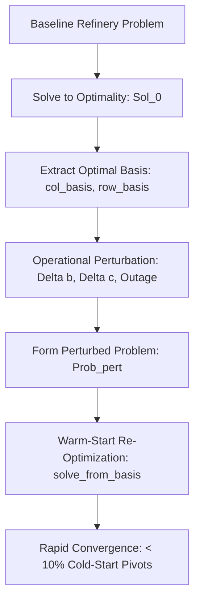

# Warm-Start Re-Optimization for Industrial Refinery Planning

## 1. Overview & Operational Motivation

In continuous refinery operations, production schedules are never solved in a vacuum. Refineries operate in dynamic market and physical environments where small perturbations occur continuously:
1. **Feedstock Price Volatility**: Crude spot cargo prices shift daily by $\$1 - \$5/\text{bbl}$.
2. **Product Offtake Swings**: Pipeline nominations, ship loadings, or terminal tank limits adjust required deliveries.
3. **Operational Turndowns & Equipment Outages**: A pump failure, furnace tube fouling, or emergency compressor trip temporarily reduces conversion capacity (e.g. FCC or HDT throughput drops by 20%).

Solving a perturbed refinery LP/MILP from a cold start (slack basis or crash basis) requires traversing numerous simplex pivots from the origin. In contrast, **Warm-Start Re-Optimization** exploits the fact that the optimal basis $\mathcal{B}^*$ of the baseline problem is topologically adjacent to the optimal basis of the perturbed problem.

---

## 2. Mathematical Principles of Simplex Warm-Starting

Consider the linear program:
$$\min c^T x \quad \text{s.t.} \quad A x = b, \quad l \le x \le u$$
with optimal basis $\mathcal{B}$, basic solution $x_B = B^{-1} b$, and dual solution $y^T = c_B^T B^{-1}$.

### 2.1 Scenario A: Perturbation in RHS Bounds ($b, l, u$)
When crude supplies, unit capacities, or product demand bounds shift:
$$b \leftarrow b + \Delta b$$
- **Dual Feasibility is Preserved**:
  $$s_N = c_N - A_N^T y = c_N - A_N^T (B^{-T} c_B)$$
  Since $c$ and $A$ have not changed, the reduced costs $s_N$ remain identically optimal ($\ge 0$ for minimization).
- **Primal Infeasibility**:
  $$x_B' = B^{-1} (b + \Delta b)$$
  Some basic variables may violate bounds: $x_{B, i}' < l_{B, i}$ or $x_{B, i}' > u_{B, i}$.
- **Dual Simplex Re-Optimization**:
  The **Dual Simplex** algorithm (`sih_solver.SimplexSolver.solve_from_basis`) starts directly from $(\mathcal{B}, x_B', y)$. Because the basis is already dual feasible, Dual Simplex requires only a minimal number of bound-restoring ratio tests (often 1 to 5 pivots) to re-attain primal feasibility!

### 2.2 Scenario B: Perturbation in Objective Coefficients ($c$)
When crude purchase prices or product market values shift:
$$c \leftarrow c + \Delta c$$
- **Primal Feasibility is Preserved**:
  $$x_B = B^{-1} b$$
  Primal coordinates remain strictly feasible ($l \le x \le u$).
- **Dual Infeasibility**:
  Reduced costs $s_N' = (c_N + \Delta c_N) - A_N^T B^{-T} (c_B + \Delta c_B)$ may violate optimality signs.
- **Primal Simplex Re-Optimization**:
  The **Primal Simplex** algorithm starts from the preserved feasible primal basis and performs cost-improving pivots to restore dual optimality.

---

## 3. Workflow Architecture in Refinery Optimizer



### 3.1 Basis Serialization & Transfer
The Phase 0/1 C++ engine stores basis vectors:
- `col_basis`: `std::vector<BasisStatus>` indicating whether variable $j$ is `Basic`, `AtLower`, `AtUpper`, or `Free`.
- `row_basis`: `std::vector<BasisStatus>` for row slack activity.

When a perturbed problem is constructed with identical row/column indices:
```python
# Warm-start execution via Python bindings
options = sih_solver.Options()
options.strategy.algorithm = sih_solver.AlgorithmChoice.DualSimplex
sol_warm = sih_solver.solve_from_basis(
    prob_perturbed,
    sol_base.col_basis,
    sol_base.row_basis,
    options
)
```

---

## 4. Empirical Evaluation Protocol

To validate warm-starting, we execute a sequential perturbation cascade across 5 operational events:
1. **Crude Price Shock**: Arab Light +$10/bbl, Brent -$5/bbl ($\Delta c$)
2. **Product Demand Spike**: Gasoline Regular demand +25% ($\Delta b$)
3. **Hydrotreater (HDT) Turndown**: Capacity reduced by 15% due to catalyst coking ($\Delta b$)
4. **Sweet Crude Supply Restriction**: Brent maximum supply capped at 50,000 bpd ($\Delta u$)
5. **Combined Market Shock**: Simultaneous crude price and diesel specification shift

For each perturbation, we measure:
- **Simplex Iterations**: Cold-start vs Warm-start
- **Wall-Clock Time**: Cold-start vs Warm-start (ms)
- **Speedup Factor**: $\frac{\text{Time}_{\text{cold}}}{\text{Time}_{\text{warm}}}$
